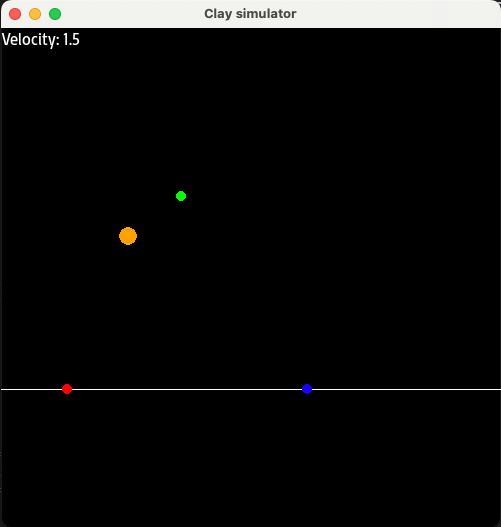

# 🦆 Clay Trajectory Simulator
## About

The aim of the project is to develop a simulator that will make it easier for shooters to practice their accuracy when shooting to clays.

## 💡 Features

- Parabolic style trajectory setup
- Clay size adjustment
- Clay speed adjustment
- Play/Pause simulation in any moment
- Trun on/off characteristic points of trajectory

## 🖥️ Installation

```sh

pip3 install -r requirements.txt
python3 main.py

```

## Screens


